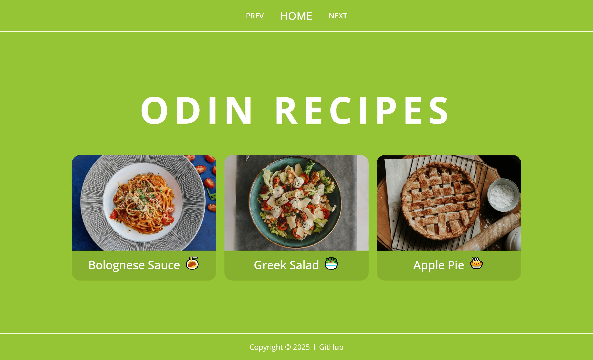

# Odin Recipes

## Preview



## Description

A collection of delicious recipes presented in a simple, multi-page website. The project features a main index page that links to individual recipe pages, each containing a description, ingredients, and step-by-step instructions.

This project was completed for the **["Recipes"](https://www.theodinproject.com/lessons/foundations-recipes)** of the **[Foundations Course](https://www.theodinproject.com/paths/foundations/courses/foundations)** within the **[Foundations](https://www.theodinproject.com/paths/foundations)** path from **[The Odin Project](https://www.theodinproject.com/)**.

## Technologies Used

- HTML5
- CSS3
- Git & GitHub
- Command Line
- Visual Studio Code

## Installation

1.  **Clone the repository**

    ```sh
    git clone https://github.com/yevgengvr/odin-recipes.git
    ```

2.  **Navigate to the project directory**
    ```sh
    cd odin-recipes
    ```

## Usage

Open the `index.html` file in your web browser. You can do this by double-clicking the file in your file explorer or by using your IDE's live server extension.

## Acknowledgments

- [The Odin Project](https://www.theodinproject.com/) curriculum team
- Recipe inspiration from [Allrecipes](https://www.allrecipes.com/)
- Photo by [Danijela Prijovic](https://unsplash.com/@dacakockica?utm_content=creditCopyText&utm_medium=referral&utm_source=unsplash) on [Unsplash](https://unsplash.com/photos/pasta-with-red-sauce-on-white-ceramic-round-plate-qits91IZv1o?utm_content=creditCopyText&utm_medium=referral&utm_source=unsplash)
- Photo by [Priscilla Du Preez 🇨🇦](https://unsplash.com/@priscilladupreez?utm_content=creditCopyText&utm_medium=referral&utm_source=unsplash) on [Unsplash](https://unsplash.com/photos/brown-pie-on-brown-wooden-table-SU5jSHu1pK8?utm_content=creditCopyText&utm_medium=referral&utm_source=unsplash)
- Photo by [Frames For Your Heart](https://unsplash.com/@framesforyourheart?utm_content=creditCopyText&utm_medium=referral&utm_source=unsplash) on [Unsplash](https://unsplash.com/photos/vegetable-salad-on-blue-ceramic-bowl-J5eOPeFqcuY?utm_content=creditCopyText&utm_medium=referral&utm_source=unsplash)

## Project Links

**[Live Preview](https://yevgengvr.github.io/odin-recipes/)** and **[Source](https://github.com/yevgengvr/odin-recipes)**.
